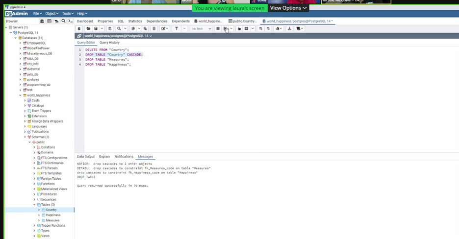
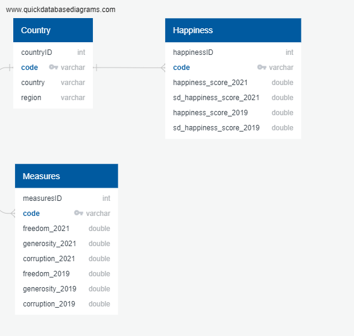
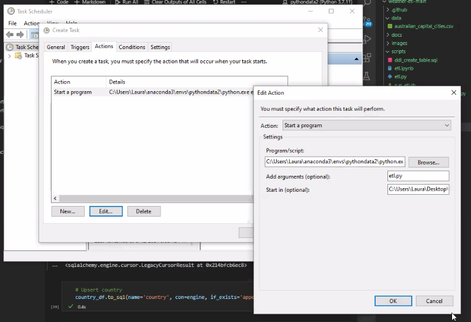

## ETL PROJECT REPORT
## World Happiness 2019-2021 Data

# Objective
The main purpose of this project is to provide a detailed analysis of the ETL(Extract-Transform-Load) process by reading the dataset of the World Happiness report obtained from Kaggle, which is a landmark survey of the state of global happiness, cleaning the dataset in the desired form and load into a database for storage.
The data comes Kaggle dataset collected from the years 2019 to 2021. This .csv files can be found in the Resources folder of this repository.

# Problem Statement

We have been faced some challenging creating and reading the data in Postgres SQL. One of the problems was because we were using capital letters in the pgAdmin, the best practise it is to use SELECT * FROM in capital letters.
To solve the issue, we had to use cascade to automatically drop objects, and then pin in the table. We copied the table code from Pd Admin and pasted in the pgAdmin, refreshed the data and finally connected to Visual Code.
The other problem was with unknown values, we solved the problem creating an index that we had for every simple table.

# Data Cleanup and Analysis
We have performed the ETL process in three steps: 

#Step1:  Data Extraction

The data has been downloaded from public platform Kaggle with the following link - https://www.kaggle.com/, the files used for extraction were originally formatted as .csv.
*	World Happiness Report 2019 | Kaggle
*	World Happiness Report 2021 | Kaggle
The .csv files are then read into a Pandas data frame in Jupyter notebook.

#Step 2: Transformation

We used Python as the tool to perform the transformation on the datasets using Pandas library, described in the following steps:
*   The files were first read into the Pandas data frame, using read_csv.
*	The columns that were not relevant were then dropped from the two data frames by selecting the columns, namely 'Country name’, ‘Regional indicator’, ‘Ladder score’, ‘Standard error of ladder score', 'Logged GDP per capita','Social support', 'Healthy life expectancy', 'Freedom to make life choices', 'Generosity’, ‘Perceptions of corruption’.
*	Both data frame was renamed to clean_2021 and clean_2019.
*	NA values were dropped from both Data frames using dropna function and isnull.
*	Duplicates were checked using duplicated().sum().
*	A transformed_functions were imported to convert country code from countries we had in our data set.
*	Code was added into our main_df.
*	Filtered out unknown codes leaves us with 121 rows.
*	Two Data frames were created named measures_df and happiness_df.
*	Create country data frame, setting index to new column countryID.

# Step 3: Loading

*	We have used relational database, Postgres SQL to load our data. 
*	Then we establish a connection between SQL database using create_engine() in SQLAlchemy library, where we have created two tables and load the data frames we have in the tables.
*	We then reflected an existing database into a new model, and we used MetaData to create an object in order to specify the key name.
*	Then, we used to reflect to delete tables in reverse order. We also used upsert function to upsert our two data frames, country_df and measures_df, and finally it was converted to SQL using to.sql.

# Scheduling

